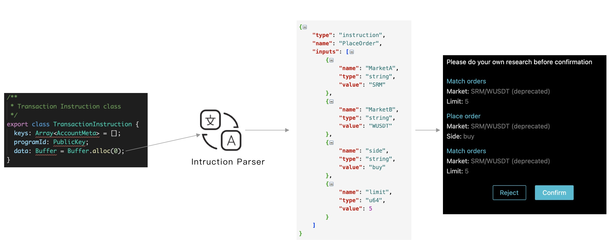

# Solana合约Instruction的JSON解析约定

## 背景
由于Solana的Instruction中的data部分没有严肃的ABI约定，因此在钱包签名Transaction
中的Instruction，没法很好的展示Instruction的内容。因此大家急需一套规则来解析
Instruction中的data部分给用户确认。

## 约定
这里参照ETH的ABI的JSON定义[The JSON format for a contract’s interface](https://docs.soliditylang.org/en/develop/abi-spec.html#json)

我们取其中的function部分，然后给inputs的单元增加一个value的部分，由业务方自己按照自己项目
的序列化方式，将其解析成一个这样的结构，然后返回给钱包。这样钱包就可以展示Instruction的内容了。

JSON格式为：

* type: 固定为："instruction"
* name:  instuction的名字
* program: 合约地址
* inputs: 一个对象数组，表示参数，包含了:
    * name: 参数名
    * value: 具体值,以string来表示

这里的初衷只是为了在展示给用户看的时候，尽量人为可读一些，不同于传统的ABI策略，类似[anchor](https://github.com/project-serum/anchor) 虽然提供了类似abi的机制，但是在解析成人为可读方面，一个实现较为繁琐，二个
从IDL定义的变量名未必普通非程序猿用户易懂。

这里的定义通过name表示哪个指令，然后拼接K-V对来表示调用了哪些参数，也就是这里的name和value，name可以尽量定义
的人为可读一些，这样用户更容易理解，而不是ABI中定义的，程序猿更容易理解。

## 示例

### 1. System.createAccount
先来看其定义：

    /**
    * Create account system transaction params
    * @typedef {Object} CreateAccountParams
    * @property {PublicKey} fromPubkey
    * @property {PublicKey} newAccountPubkey
    * @property {number} lamports
    * @property {number} space
    * @property {PublicKey} programId
    */
    export type CreateAccountParams = {|
        fromPubkey: PublicKey,
        newAccountPubkey: PublicKey,
        lamports: number,
        space: number,
        programId: PublicKey,
    |};

这里可以定义成这样：

    {
        "type": "instruction", 
        "name": "CreateAccount", 
        "program": "11111111111111111111111111111111", 
        "inputs": [
            {
                "name": "fromPubkey", 
                "value": "EBA5RN8pZuGnTGfUiKcLoU7Vzf8kyXurmpRTu5k7jb7x"
            }, 
            {
                "name": "newAccountPubkey", 
                "value": "EBA5RN8pZuGnTGfUiKcLoU7Vzf8kyXurmpRTu5k7jb7x"
            }, 
            {
                "name": "lamports", 
                "value": "128"
            }, 
            {
                "name": "space", 
                "value": "128"
            }
        ]
    }

## 为什么不用Anchor

* 即使使用Anchor，也需要一个"合约地址-IDL"对应的关系，否则钱包也不知道该如何用哪个IDL
* Anchor使用门槛较高，先得了解IDL、然后得DApp和合约都要使用Anchor的SDK
* Anchor不够灵活，使用了Anchor需要DApp和合约都要使用Anchor,如果遇到Anchor支持不好的结构，还得自己实现
* Anchor本质是序列化方式，类似ProtoBuf，不是ABI。他主要解决的问题是如何解决Instruction和Account
的序列化和反序列化的功能，但是并不适合用户去理解，比如Rent账号、System账号，这些是不需要用户关心的，
会导致给用户信息太多，比如Serum的NewOrder加上这些无关信息有十多个Account地址

