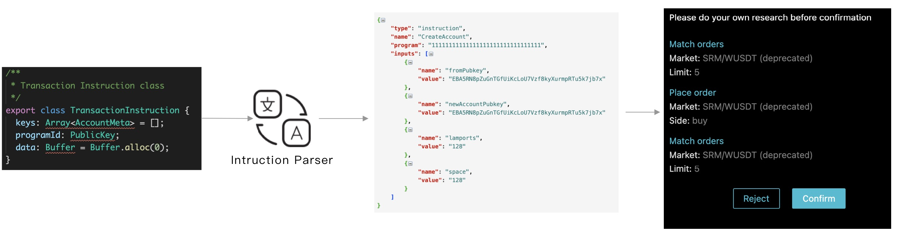

# Solana合约Instruction的JSON解析约定

## 背景
由于Solana的Instruction中的data部分没有严肃的ABI约定，因此在钱包签名Transaction
中的Instruction，没法很好的展示Instruction的内容。因此大家急需一套规则来解析
Instruction中的data部分给用户确认。

## 约定
这里参照ETH的ABI的JSON定义[The JSON format for a contract’s interface](https://docs.soliditylang.org/en/develop/abi-spec.html#json)

我们取其中的function部分，然后给inputs的单元增加一个value的部分，由业务方自己按照自己项目
的序列化方式，将其解析成一个这样的结构，然后返回给钱包。这样钱包就可以展示Instruction的内容了。

JSON格式为：

* type: 固定为："instruction"
* name:  instuction的名字
* program: 合约地址
* inputs: 一个对象数组，表示参数，包含了:
    * name: 参数名
    * type: 参数类型
    * value: 具体值
    * components:  嵌套对象

## 示例

